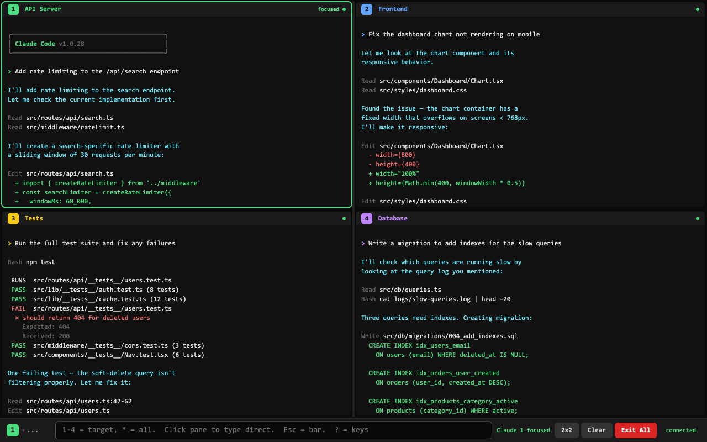

# QuadMux

Run multiple [Claude Code](https://docs.anthropic.com/en/docs/claude-code) instances side-by-side in a browser-based terminal multiplexer.



## Why

Claude Code runs in a single terminal. When you're working across multiple projects, debugging in parallel, or want different Claude instances handling different tasks simultaneously, you need multiple terminals. QuadMux gives you a clean 2x2 grid of Claude Code instances in your browser with shared keyboard control.

## Features

- **2x2 grid** of fully interactive Claude Code terminals (xterm.js)
- **Draggable gutters** to resize panes
- **Multiple layouts** - 2x2, 1x4 (stacked), 4x1 (side-by-side)
- **Input bar** - prefix with `1`-`4` to target a pane, `*` for all
- **Click-to-focus** - click any pane to type directly into it
- **Auto-focus** - panes requesting input automatically grab focus
- **Per-pane search** (Ctrl+F)
- **Health indicators** - green/red dots show which instances are alive
- **Editable titles** - click pane titles to rename them (persisted in localStorage)
- **Output buffering** - new browser tabs catch up on existing output
- **Keyboard shortcuts** - press `?` in the input bar

## Requirements

- macOS or Linux (uses `pty.fork()`)
- Python 3.8+
- `websockets` (`pip install websockets`)
- [Claude Code CLI](https://docs.anthropic.com/en/docs/claude-code) installed and on PATH

## Quick Start

```bash
# Install dependency
pip install websockets

# Run it
python3 quadmux-server.py

# Open http://localhost:8765 in your browser
```

The server spawns 4 Claude Code instances and serves the web UI on the same port.

## Usage

### Input Bar (bottom of screen)

| Input | Action |
|-------|--------|
| `1fix the bug in auth.py` | Send to pane 1 |
| `2ls -la` | Send to pane 2 |
| `*y` | Send "y" to all panes |
| `?` | Show keyboard shortcuts |

**Single character** after the pane number is sent as a raw keypress (good for `y`/`n` prompts).
**Multiple characters** are sent as a command + Enter.

### Direct Focus

Click any pane to focus it. Type directly into the focused terminal. Press `Esc` to return to the input bar.

### Keyboard Shortcuts

| Key | Action |
|-----|--------|
| `Esc` | Return to input bar |
| `Ctrl+1`-`4` | Focus pane directly |
| `Ctrl+F` | Search in focused pane |
| `Ctrl+L` | Clear focused pane |
| `Ctrl+Shift+L` | Toggle layout |

## Options

```bash
python3 quadmux-server.py --shells 2 --port 9000
```

| Flag | Default | Description |
|------|---------|-------------|
| `--shells` | 4 | Number of Claude instances |
| `--port` | 8765 | HTTP/WebSocket port |

## How It Works

1. **Server** (`quadmux-server.py`): Spawns Claude Code instances using `pty.fork()` (not subprocess — Claude opens `/dev/tty` directly, so pipes don't work). Reader threads forward PTY output over WebSocket. The `pty.fork()` calls happen before `asyncio.run()` starts, which is required for the reader threads to receive data.

2. **Frontend** (`quadmux.html`): Four xterm.js terminals connected via WebSocket. Handles input routing, layout management, and search.

## Limitations

- macOS/Linux only (no Windows — `pty.fork()` is POSIX)
- Uses `--dangerously-skip-permissions` flag for non-interactive operation
- WebSocket is unencrypted (localhost only)

## License

MIT
